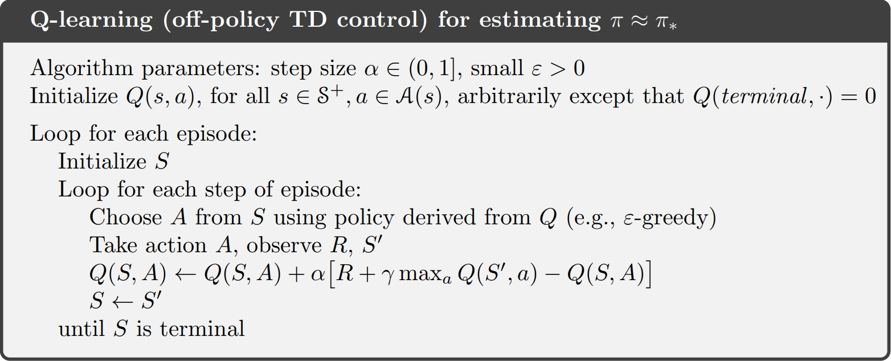

# Documentation

Maked by Volodymyr Novokhatskyi

Task: [Mountain Car Continuous](https://gymnasium.farama.org/environments/classic_control/mountain_car_continuous/)

## Problem description

We have a car placed stochastically at the bottom of a sinusoidal valley, 
with the only possible actions being the accelerations that can be applied to the car in either direction.

The goal is to strategically accelerate the car to reach the goal state on top of the right hill.

### Action space

The action space is continuous and defined as a single float value in the range `[-1, 1]`. 
- It represents the `directional force` applied on the car.

### Observation space

The observation space is continuous and defined by two float values:
1. `Position` is in the range `[-1.2, 0.6]`
2. `Velocity` is in the range `[-0.07, 0.07]`

### Shapes

The shapes of the observation and action spaces are as follows:

1. Observation space: (2,): 
    - `np.array([0.5, 0.05])`
2. Action space: (1,):
    - `np.array([0.5])`

### Initial state

1. The position of the car is random value in the range `[-0.6 , -0.4]`. 
2. The velocity of the car is assigned to `0`.

### Reward

A negative reward of `-0.1 * (action_value) ^ 2` is received at each timestep to penalise for taking actions of large magnitude. 
If the mountain car reaches the goal then a positive reward of `+100` is added to the negative reward for that timestep.

### Episode end

The episode terminates if either of the following happens:

1. The position of the car is greater than or equal to `0.45` (the goal position on top of the right hill)
2. The length of the episode is `999`.

### Transition dynamics

Given an action, the mountain car follows the following transition dynamics:

`velocityt+1 = velocityt+1 + force * self.power - 0.0025 * cos(3 * positiont)`

`positiont+1 = positiont + velocityt+1`

Where power is a constant `0.0015`.
The collisions at either end are inelastic with the velocity set to `0` upon collision with the wall. 

### Changes made

1. We have continuous problem, so we have to discretize the action and observation spaces.
   - For example, the action space is discretized as follows:
     - `discetized_action_space = np.linspace(-1, 1, 10)`
     - `10` means that we have `10 possible actions` in the `action space`.

### Algorithms

The following algorithms are implemented to solve the problem:\
   1. [Q-learning](#Q-learning)
   2. [SARSA](#SARSA)
   3. Monte Carlo Control on-policy
   4. Monte Carlo Control off-policy

### Q-learning

Q-learning is a model-free reinforcement learning algorithm to learn the value of an action in a particular state.

#### Pseudocode

Zdroj: Sutton-Barto: Reinforcement Learning, 2nd ed., 2018

### Changes made

1. By pseudocode, we initialize the Q-table with random values, except for the terminal state. But in our case, we have 2 implementations zeros and random values. 

#### Results

The hyperparameters used in the Q-learning algorithm are as follows:

1. `Alpha` (learning rate) 
2. `Gamma` (discount factor) = `0.99`
3. `Epsilon` (exploration rate) = `0.1`
4. `Episodes` (count of steps needed to reach the goal)
5. `Decay Rate` (rate at which the epsilon decreases)
   - Each step of the episode, the `epsilon = epsilon - decay_rate`

The metrics used to evaluate the performance of the Q-learning algorithm are as follows:

1. `Average reward`
   - `np.mean(total_rewards)`
2. `Max reward`
   - `np.max(total_rewards)`
3. `Average steps`
   - `np.mean(steps)`
4. `Success rate`
   - `np.sum(np.array(self.rewards) > -200) / len(self.rewards)`
   

| Experiment | Alpha | Gamma | Epsilon | Decay Rate | Episodes | Use Random Values | Action Space Steps | Obs Space Dimensions | Avg Reward | Max Reward | Avg Steps  | Success Rate |
|------------|-------|-------|---------|------------|----------|-------------------|--------------------|----------------------|------------|------------|------------|--------------|
| 1          | 0.1   | 0.8   | 0.8     | 0.001      | 500      | False             | 5                  | [20, 20]              | -199.56    | 74.73      | 10185.51   | 0.66         |
| 2          | 0.1   | 0.9   | 0.6     | 0.0001     | 500      | True              | 5                  | [50, 50]              | -38.45     | 82.02      | 4487.65    | 0.92         |
| 3          | 0.1   | 0.99  | 0.5     | 0.0001     | 500      | False             | 5                  | [50, 50]              | -628.41    | 79.37      | 20800.21   | 0.39         |
| 4          | 0.2   | 0.8   | 0.5     | 0.0001     | 500      | True              | 5                  | [100, 100]            | -31.00     | 81.60      | 4611.87    | 0.94         |
| 5          | 0.2   | 0.9   | 0.65    | 0.0001     | 500      | False             | 5                  | [40, 40]              | -159.01    | 81.05      | 7484.86    | 0.80         |
| 6          | 0.2   | 0.99  | 0.4     | 0.0001     | 500      | True              | 3                  | [100, 100]            | -158.17    | 82.00      | 9716.99    | 0.72         |
| 7          | 0.3   | 0.8   | 0.5     | 0.0001     | 500      | False             | 10                 | [20, 20]              | -207.12    | 82.69      | 13995.58   | 0.70         |
| 8          | 0.3   | 0.9   | 0.45    | 0.0001     | 500      | True              | 5                  | [50, 50]              | 0.08       | 81.00      | 4038.02    | 0.98         |
| 9          | 0.3   | 0.99  | 0.4     | 0.0001     | 500      | False             | 9                  | [20, 20]              | -11.05     | 93.66      | 4210.35    | 0.95         |
| 10         | 0.4   | 0.8   | 0.5     | 0.0001     | 1000     | True              | 10                 | [20, 20]              | -61.57     | 91.13      | 7113.14    | 0.86         |
| 11         | 0.4   | 0.9   | 0.55    | 0.0001     | 1000     | False             | 5                  | [50, 50]              | -11.56     | 88.70      | 3750.19    | 0.95         |
| 12         | 0.4   | 0.99  | 0.8     | 0.0009     | 1000     | True              | 3                  | [50, 50]              | -36.00     | 91.00      | 2148.07    | 0.87         |
| 13         | 0.5   | 0.8   | 0.6     | 0.0005     | 1000     | False             | 10                 | [20, 20]              | -12.10     | 94.02      | 5448.53    | 0.93         |
| 14         | 0.5   | 0.9   | 0.45    | 0.0005     | 1000     | True              | 5                  | [50, 50]              | 45.87      | 94.75      | 12429.25   | 1.00         |
| 15         | 0.5   | 0.99  | 0.4     | 0.0005     | 1000     | False             | 9                  | [50, 50]              | -122.28    | 90.98      | 9297.89    | 0.92         |

### SARSA

SARSA is a model-free reinforcement learning algorithm to learn the value of an action in a particular state.

#### Pseudocode

Zdroj: Sutton-Barto: Reinforcement Learning, 2nd ed., 2018

### Changes made

1. By pseudocode, we initialize the Q-table with random values, except for the terminal state. But in our case, we have 2 implementations zeros and random values.
2. We limit the number of steps in the episode to `100_000`. Because the car can't reach the goal in some cases.
   - So episodes will end if the car reaches the goal or the number of steps exceeds `100_000`.

#### Results

The hyperparameters used in the SARSA algorithm are as follows:

1. `Alpha` (learning rate)
2. `Gamma` (discount factor) = `0.99`
3. `Epsilon` (exploration rate) = `0.1`
4. `Episodes` (count of steps needed to reach the goal)
5. `Decay Rate` (rate at which the epsilon decreases)
   - Each step of the episode, the `epsilon = epsilon - decay_rate`

The metrics used to evaluate the performance of the SARSA algorithm are as follows:

1. `Average reward`
   - `np.mean(total_rewards)`
2. `Max reward`
    - `np.max(total_rewards)`
3. `Average steps`
    - `np.mean(steps)`
4. `Success rate`
    - `np.sum(np.array(self.rewards) > -200) / len(self.rewards)`

| Experiment | Alpha | Gamma | Epsilon | Decay Rate | Episodes | Use Random Values | Action Space Steps | Obs Space Dimensions  | Avg Reward  | Max Reward | Avg Steps | Success Rate |
|------------|-------|-------|---------|------------|----------|-------------------|--------------------|-----------------------|-------------|------------|-----------|---------|
| 1          | 0.1   | 0.8   | 0.8     | 0.001      | 500      | False             | 5                  | [20, 20]              | -1955.32    | 77.18      | 40063.97  | 0.28    |
| 2          | 0.1   | 0.9   | 0.6     | 0.0001     | 500      | True              | 5                  | [50, 50]              | -638.23     | 75.72      | 14291.85  | 0.55    |
| 3          | 0.1   | 0.99  | 0.5     | 0.0001     | 500      | False             | 5                  | [50, 50]              | -438.70     | 81.72      | 11034.95  | 0.72    |
| 4          | 0.2   | 0.8   | 0.5     | 0.0001     | 500      | True              | 5                  | [100, 100]            | -120.66     | 80.50      | 4314.19   | 0.86    |
| 5          | 0.2   | 0.9   | 0.65    | 0.0001     | 500      | False             | 5                  | [40, 40]              | -709.43     | 70.15      | 15424.89  | 0.50    |
| 6          | 0.2   | 0.99  | 0.4     | 0.0001     | 500      | True              | 3                  | [100, 100]            | -305.33     | 78.60      | 6474.74   | 0.74    |
| 7          | 0.3   | 0.8   | 0.5     | 0.0001     | 500      | False             | 10                 | [20, 20]              | -2091.03    | 83.63      | 50201.72  | 0.31    |
| 8          | 0.3   | 0.9   | 0.45    | 0.0001     | 500      | True              | 5                  | [50, 50]              | -1403.98    | 85.72      | 28956.00  | 0.40    |
| 9          | 0.3   | 0.99  | 0.4     | 0.0001     | 500      | False             | 9                  | [20, 20]              | -2747.22    | 91.22      | 71000.95  | 0.21    |
| 10         | 0.4   | 0.8   | 0.5     | 0.0001     | 1000     | True              | 10                 | [20, 20]              | -2748.30    | 81.65      | 66757.35  | 0.19    |
| 11         | 0.4   | 0.9   | 0.55    | 0.0001     | 1000     | False             | 5                  | [50, 50]              | -959.53     | 75.08      | 20683.11  | 0.43    |
| 12         | 0.4   | 0.99  | 0.8     | 0.0009     | 1000     | True              | 3                  | [50, 50]              | -1751.53    | 87.10      | 31226.42  | 0.40    |
| 13         | 0.5   | 0.8   | 0.6     | 0.0005     | 1000     | False             | 10                 | [20, 20]              | -2818.18    | 83.32      | 67761.74  | 0.19    |
| 14         | 0.5   | 0.9   | 0.45    | 0.0005     | 1000     | True              | 5                  | [50, 50]              | -1739.11    | 83.12      | 46328.64  | 0.33    |
| 15         | 0.5   | 0.99  | 0.4     | 0.0005     | 1000     | False             | 9                  | [50, 50]              | -2706.70    | 88.86      | 62500.66  | 0.25    |

### Monte Carlo Control on-policy
Monte Carlo Control is a model-free reinforcement learning algorithm to learn the value of an action in a particular state.

#### Pseudocode

Zdroj: Sutton-Barto: Reinforcement Learning, 2nd ed., 2018

### Changes made

1. By pseudocode, we initialize the Q-table with random values, except for the terminal state. But in our case, we have 2 implementations zeros and random values.

#### Results

The hyperparameters used in the Monte Carlo Control on-policy algorithm are as follows:

1. `Alpha` (learning rate)

### Monte Carlo Control off-policy

Monte Carlo Control is a model-free reinforcement learning algorithm to learn the value of an action in a particular state.

#### Pseudocode

Zdroj: Sutton-Barto: Reinforcement Learning, 2nd ed., 2018

### Changes made

1. By pseudocode, we initialize the Q-table with random values, except for the terminal state. But in our case, we have 2 implementations zeros and random values.

#### Results

| Experiment | Alpha | Gamma | Epsilon | Decay Rate | Episodes | Use Random Values | Action Space Steps | Obs Space Dimensions  | Avg Reward | Max Reward | Avg Steps | Success Rate |
|------------|-------|-------|---------|------------|----------|-------------------|--------------------|-----------------------|------------|------------|-----------|--------------|
| 1          | 0.1   | 0.8   | 0.8     | 0.001      | 500      | False             | 5                  | [20, 20]              | -375.10    | 71.25      | 9497.31   | 0.40         |
| 2          | 0.1   | 0.9   | 0.6     | 0.0001     | 500      | True              | 5                  | [50, 50]              | -375.22    | 63.88      | 9500.80   | 0.44         |
| 3          | 0.1   | 0.99  | 0.5     | 0.0001     | 500      | False             | 5                  | [50, 50]              | -373.86    | 62.15      | 9483.11   | 0.42         |
| 4          | 0.2   | 0.8   | 0.5     | 0.0001     | 500      | True              | 5                  | [100, 100]            | -380.19    | 73.55      | 9602.50   | 0.44         |
| 5          | 0.2   | 0.9   | 0.65    | 0.0001     | 500      | False             | 5                  | [40, 40]              | -404.36    | 70.40      | 10082.23  | 0.42         |
| 6          | 0.2   | 0.99  | 0.4     | 0.0001     | 500      | True              | 3                  | [100, 100]            | -274.99    | 72.60      | 5624.08   | 0.53         |
| 7          | 0.3   | 0.8   | 0.5     | 0.0001     | 500      | False             | 10                 | [20, 20]              | -455.70    | 75.80      | 13638.49  | 0.38         |
| 8          | 0.3   | 0.9   | 0.45    | 0.0001     | 500      | True              | 5                  | [50, 50]              | -393.60    | 66.82      | 9872.10   | 0.43         |
| 9          | 0.3   | 0.99  | 0.4     | 0.0001     | 500      | False             | 9                  | [20, 20]              | -485.01    | 69.69      | 14042.15  | 0.38         |
| 10         | 0.4   | 0.8   | 0.5     | 0.0001     | 1000     | True              | 10                 | [20, 20]              | -492.86    | 73.78      | 14556.15  | 0.35         |
| 11         | 0.4   | 0.9   | 0.55    | 0.0001     | 1000     | False             | 5                  | [50, 50]              | -354.49    | 77.80      | 9087.73   | 0.45         |
| 12         | 0.4   | 0.99  | 0.8     | 0.0009     | 1000     | True              | 3                  | [50, 50]              | -297.19    | 78.10      | 5956.35   | 0.50         |
| 13         | 0.5   | 0.8   | 0.6     | 0.0005     | 1000     | False             | 10                 | [20, 20]              | -497.48    | 69.17      | 14662.47  | 0.35         |
| 14         | 0.5   | 0.9   | 0.45    | 0.0005     | 1000     | True              | 5                  | [50, 50]              | -379.50    | 79.95      | 9591.88   | 0.44         |
| 15         | 0.5   | 0.99  | 0.4     | 0.0005     | 1000     | False             | 9                  | [50, 50]              | -468.27    | 82.08      | 13631.34  | 0.39         |

